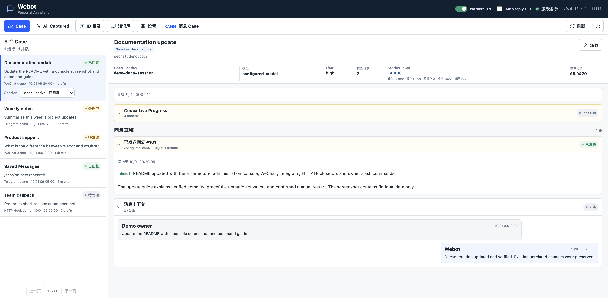
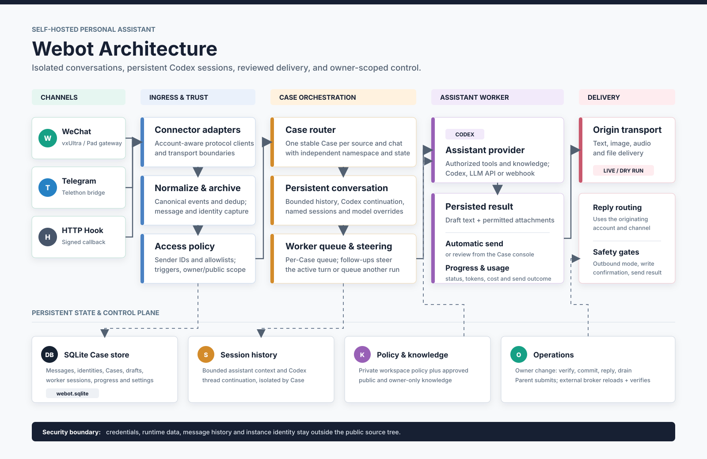

# Webot

A self-hosted personal assistant and digital twin for **WeChat, Telegram, and
signed HTTP hooks**. Bring AI conversations, approved knowledge, and
owner-authorized tasks into the chats you already use.

## Administration Console



*The actual administration UI with fictional demonstration data, not a live
account or private conversation.*

The console brings conversations, captured WeChat messages, an ID directory,
knowledge, and settings into one workspace. Review worker progress, inspect
session usage and estimated cost, approve drafts, and control workers and
automatic replies without losing conversation state.

## Webot and vxUltra

| Component | Responsibility |
| --- | --- |
| **vxUltra / compatible WeChatPad gateway** | Connects to WeChat and exposes account-scoped HTTP APIs and WebSocket events. Operated separately; not bundled with Webot. |
| **Webot** | Applies identity and reply policy, isolates conversations, manages knowledge and AI sessions, stores drafts, and routes replies to the original account. |
| **Assistant provider** | Generates replies and, when authorized and supported, uses tools. Codex is the default; OpenAI-compatible APIs, an assistant webhook, and an echo test provider are also supported. |

For example: a WeChat message arrives through vxUltra, Webot selects the
conversation and permitted knowledge, the assistant prepares a reply, and
Webot sends it back through the originating WeChat account.

Use vxUltra alone when your program only needs WeChat APIs. Add Webot when you
want a conversational assistant with persistent sessions, knowledge, and task
execution. Telegram uses its own bridge and does not require a WeChat gateway.

## Architecture



Each channel normalizes messages into a common format. Identity and access
checks determine which messages may enter an isolated Case. Owner-created
named sessions keep separate histories, Codex continuations, models, and
reasoning settings within the same chat.

Workers run serially within a Case; different Cases can run concurrently.
Follow-up messages can steer an active Codex turn or queue a continuation.
Worker execution, stored drafts, and confirmed sending are separate stages:
**receiving a message is not proof of a reply, and a draft is not proof of
delivery**.

State lives outside the source tree: SQLite stores Cases, messages, identities,
drafts, progress, and usage; private session and knowledge directories retain
conversation context and instance policy.

See [Architecture](docs/architecture.md) for the detailed message, storage,
worker, and runtime-control flow.

## Supported Channels

| Channel | Inbound connection | Reply path | Setup |
| --- | --- | --- | --- |
| **WeChat** (`pad`) | One or more separately operated WeChatPad-compatible gateways; WebSocket events and account-specific policy. | The originating account's HTTP API. Text and supported image, audio, and file delivery depend on the gateway. | [WeChat gateway guide](docs/wechatpad-gateway.md) |
| **Telegram** (`telegram`) | An authorized **user account** through the included Python/Telethon JSON-lines bridge; private chats, Saved Messages, and allowlisted groups. | The originating Telethon session; text and file attachments. | [Telegram guide](docs/telegram.md) |
| **HTTP Hook** (`hook`) | `POST /webhooks/hook` with OneBot-style private/group message events. Configure a callback secret for HMAC-SHA256 verification through `X-Webot-Signature`. | The configured hook API's `/send_private_msg` or `/send_group_msg`. | [Architecture](docs/architecture.md) |

Enable the needed connectors with `channels` or `WEBOT_CHANNELS`. These are the
implemented adapters, not a promise of built-in support for every messaging
platform. Telegram is a user-account integration, not a Bot API token setup.
Other platforms need an adapter or a compatible hook.

### Incoming Files

Incoming WeChat files are cached and validated, but their contents are **not
automatically expanded into the model context**. The assistant first receives
filename, size, type, and a current-conversation file reference, then decides
whether the task needs a read.

Files already visible in the conversation use the same attachment-read
workflow regardless of sender identity. Verified full cache paths are internal
metadata, never chat output or permission to access other files. Selected text
is read by the framework through bounded, conversation-scoped references.
Download credentials are not needed by the model. Files from other chats and
arbitrary filesystem paths cannot be requested through this mechanism;
permissions for private tools and system files remain unchanged.

Text previews are limited to 64 KiB per file and 128 Ki characters per turn,
with at most six file references. Truncation and unsupported formats are
reported explicitly. Known attachment cache paths are removed from final and
intermediate chat text; actual file delivery still uses attachments.

## Quick Start

### 1. Prepare the Runtime

Install **Node.js 22 or newer** and configure the assistant provider you want
to use. For Codex, use a working local installation and authentication; Webot
keeps authentication outside the repository.

From a checkout of this repository:

```bash
npm install
npm run verify
npm start
```

Open the local console at `http://127.0.0.1:18120`.

### 2. Connect One Test Chat

For WeChat, first log in to your separately operated gateway and verify that
the account is online. In Webot Settings, configure the account's stable ID,
HTTP API URL, WebSocket URL, and account-scoped credential. Start with a narrow
private-chat allowlist and perform the connection check.

For Telegram, install `telethon` in the configured Python environment and
provide an existing authorized session, API credentials, and a Telegram source.
Enable the `telegram` channel. The service does not interactively ask for login
codes or a two-factor password. See the [Telegram guide](docs/telegram.md)
before expanding beyond Saved Messages.

WeChat gateway examples in this repository describe local gateway integration.
Do not substitute a localhost URL for a hosted Cloud API, or assume a Cloud
send-message URL supplies the WebSocket and authentication contract Webot needs.
Use the gateway's documentation for its actual connection parameters.

### 3. Verify Before Sending

New installations use **dry-run** outbound mode. Send a message in your test
chat and verify that the correct account receives it, a Case is created, the
worker runs, and a useful draft appears.

Set the outbound mode to `live` only after checking the account and recipient.
With **Auto reply** off, review and send drafts manually; with it on, drafts
follow the configured automatic-send policy. Auto reply does not bypass
dry-run mode. Verify the reply in the destination chat before expanding the
allowlists.

### 4. Add Knowledge and Tasks

Use the Knowledge view to edit Markdown documents. Approved knowledge must
declare `approved: true` and an audience of `public` or `owner`. Undeclared,
invalid, or unapproved material must not be treated as public.

Configure the trusted owner using stable sender IDs, not nicknames or group
cards. Public users can receive permitted public answers; access to private
files, credentials, development tools, and operational actions requires the
configured owner's explicit authorization and instance policy.

## Owner Slash Commands

Send these as messages in an accepted WeChat or Telegram conversation.
Only a requester identified as the configured owner can invoke control
commands; being in an owner's group or using the same nickname grants no
additional permissions.

| Command | What it does |
| --- | --- |
| `/help` | Shows the control-command summary. |
| `/status` | Shows the current named session, model, reasoning effort, and service tier. |
| `/session` | Shows the current session and available session actions. Aliases: `/session current`, `/session show`. |
| `/sessions` | Lists sessions in this chat; the active one is marked. |
| `/session new <name>` | Creates and switches to an isolated named session. Omit the name to generate one automatically. |
| `/session <name>` | Switches to an existing session. `/session use <name>` is an alias. |
| `/session main` | Returns to the default session. |
| `/session delete <name>` | Deletes an inactive named session from selection; archived history remains. The current session and `main` cannot be deleted. |
| `/models` | Lists locally known models. Aliases: `/modes` and `/model list`. |
| `/model` | Shows the current model. |
| `/model <model>` | Sets the current session's model for subsequent tasks; an unknown name is checked through the configured authenticated model probe. |
| `/model <model> <task>` | Sets the model and immediately submits the supplied task. |
| `/model default` | Removes the session model override. `reset` and `auto` are aliases; a task may follow the argument. |
| `/effort` | Shows the current reasoning effort. |
| `/effort <level>` | Sets the session override: `low`, `medium`, `high`, `xhigh`, `max`, or `ultra`. Actual support depends on the selected model/provider. |
| `/effort default` | Removes the effort override. `reset` and `auto` are aliases. |
| `/clear` | Resets the current assistant history, Codex continuation, and model/effort overrides. It does not delete archived messages or other named sessions. Aliases: `/new`, `/reset`; these forms also accept `session` or `case`. |
| `/stop` | Stops the current session's task; it does not restart Webot or stop other Cases. Also accepts `worker`, `task`, or `case` after the command. |

Use **`/sessions`, not `/session list`**, to list sessions. Session names are
chat-local, up to 40 characters, and cannot contain slashes; `main` and
`default` are reserved.

For example:

```text
/session new website
/status
Update the website copy and run the relevant tests.
/session main
```

Model and effort overrides belong to the selected session. When sessions in
the same chat run concurrently, progress and completion replies carry a
`[session-name]` prefix, including delayed sends and retries. Independent chats
and single-session runs stay unchanged.

## Self-Iteration and Guarded Reload

In **source mode**, Codex runs from the Webot repository by default. The
configured owner can request a scoped change in chat; private instance
instructions still govern what the worker may read, change, and operate.
Ordinary users cannot authorize changes to Webot.

The intended update lifecycle is:

```text
Owner requests a change
  -> worker reads the relevant code and preserves unrelated changes
  -> implement, run npm run verify, and commit the scoped change
  -> complete reply handling; parent waits for running and queued work to drain
  -> parent submits the exact committed candidate to the external broker
  -> external supervisor reloads and verifies health and runtime revision
```

The worker must **never stop, signal, reinstall, or restart its own service**,
and must not invoke the activation broker itself. Automatic submission is
handled by the Webot parent after an authorized owner run. Reload requires
source mode, the configured external activation broker, and healthy ingress.
Set `WEBOT_ACTIVATION_BROKER_URL` for your installation's broker; installing
Webot alone does not create that external controller.

While an automatic reload waits, new tasks continue to run. Only the final
idle handoff briefly reserves scheduling. Once work is idle, unhealthy ingress
may defer submission for up to five minutes; busy workers are not treated as
a readiness timeout. Ambiguous submissions are not automatically retried.

**There is no `/restart` slash command.** Use an explicit owner task for a
source change, or the local console's power-icon Restart control:

| Action | Behavior |
| --- | --- |
| Owner-authorized source update | Verify and commit first; automatic activation waits for running and queued work to finish. |
| Update with `do not restart` | Verify and commit, but suppress automatic activation for that request. |
| Confirmed console Restart | Stops running tasks before external reload. Stopped inputs are not automatically rerun; queued work, account configuration, and stored history are retained. |
| `/stop` | Stops only the selected session's task; no service reload. |

The console Restart control requires source mode, a configured enabled Pad
account, ready ingress/settings, and the external broker. It uses an
origin-bound, per-process console token and explicit confirmation. It can
reload the current commit, not only a newer commit.

**Verify activation, not just submission.** Check the console's displayed
version/source revision, a new runtime start time, connector readiness, and
the broker's verification result. An accepted activation request or a passing
test run is not proof that the new runtime is active. The console refreshes
after observing the expected revision and a new runtime.

An example owner request:

```text
Update Webot's README and add a sanitized console screenshot.
Keep unrelated changes, run npm run verify, and commit only this task's files.
```

Append `do not restart` when you want a source-only update.

For a macOS source service, an operator can install the source launcher:

```bash
./scripts/install-launchd.sh
```

This is an **operator installation step**, never a command for the worker
running inside Webot. The launcher loads `bin/webot.js` using Node.js without
rebuilding a standalone executable. Packaged releases have a separate
installation/update lifecycle.

## Release and Privacy

```bash
npm run release
```

Release archives are written to `dist/` and contain the executable, generic
configuration templates, and public documentation.

Keep databases, messages, sessions, credentials, personal identity,
private policies, logs, generated user media, and build output out of Git.
Documentation illustrations must use sanitized or fictional data; the console
screenshot above contains no live account information.

Run `npm run privacy-check` before publishing. Bind administration and gateway
APIs to loopback or a trusted private network, use explicit allowlists and
callback secrets, and back up the private data directory before operational
changes.
